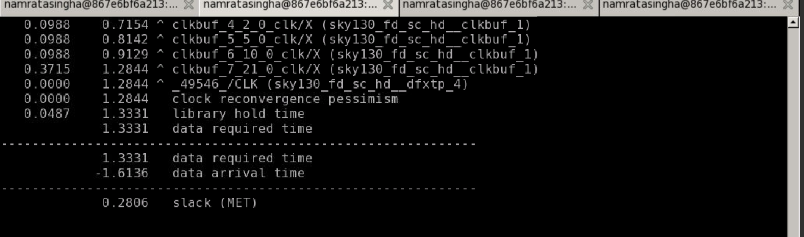

# adv_PhysicalDesign_Wrkshp
A workshop offering hands-on experience with OpenLANE EDA tool using the PDK of Skywater 130nm technology.  


# Day 1: Introduction to IC design terminologies, OpenLANE and Sky130 PDK
## IC Design Terminologies:
Integrated Chip (IC) is basically an integration of large number of transistors, resistors, capacitors fabricated into a single unit, performing a specific function. Based on the functions they perform, the ICs are categoried to analog and digital ICs. 

These ICs are enclosed in **Packages**, in the market there are multiple variation of Packages available such as through-hole mount packages, pin-grid array packages etc. The one package introduced in this workshop is QFN-48 (Quad Flat NO Leads) with a size of 7mmx7mm, here, 48 are the total number of pins that supports the information exchanges to and from the IC to the other parts of the design, variable pin packages are also available. 

**Chip** : the chip generally sits at the centre of the package and are connected to the pins of the package through wire-bonds. The Chip has various components some of them are:
  * Pads: they send information inside the chip and vice versa.
  * Core: all the logic or functionality of the chip are placed inside the core
  * Die: Area of the entire chip

**Foundry IPs and Macros**
Any typical core consists of SOC, SRAM, ADC, PLL and some other components. The PLL, SRAM, ADC, DAC in the chip core falls under the category of Foundry IPs. Foundry is the place where the chips get manufactured. In order to make IPs, some amount of intelligence is needed. Marocs are based on pure digital logic. 

## RISC-V:
RISC-V is an open standard instruction set architecture (ISA) based on established reduced instruction set computer (RISC) principles. Unlike most other ISA designs, the RISC-V ISA is provided under open source licenses that do not require fees to use. The base RISC-V is a 32-bit processor architecture with 31 general-purpose registers. All instructions are 32 bits long. Here the RISC-V implementation is picorv32. Risc-v is the specification and picorv32 is the rtl implementation of the spec. and from there it is the normal rtl to GDS flow.

## Components of ASIC flow digital design
For designing Open-Source Application Specific Integrated Circuits (ASIC) in automated way certain set of components are necessary and these components have to be opensourced i.e. open for the masses, they are: 
* RTL ips: there are many open-source rtl-ip available
* EDA tools: open-source tools --> openroad, openflow, qflow
* PDK Data:  PDK stands for Process Design Kits,it is an interface between FAB and designers and contains information such as DRC and LVS rules, SPICE Model Parameters, Digital standard cell libraries etc. Earlier PDKs are under non-disclosure agreement,now, Google + Skywater tech, open-sourced the PDKs of 130nm tech on june 30,2020. 

## RTL2GDS Flow


## Introduction to OpenLANE
On the availability of open-sourced PDK, an open-sourced methodology and flow is introduced by ***efabless*** and named it as **OpenLANE**. It is an automated RTL2GDS flow tool that is built around various open-source EDA tools such as yosys, openROAD, Magic etc. It has two modes of operation:
* Autonomous : it performs all of the ASIC flow in one step
* Interactive : It is a step-by-step process to perform every phase of ASIC flow with specific commands.

## OpenLANE detailed ASIC Design Flow:


# Day 1: Lab Instance
## PDK directory exploration:
We are using skywater-130 pdk. In the terminal, a pdk directory is provided which contains all pdk related informations
* skywater pdk --> which has all pdk files.. tech lib, lef.lib
* open_pdks: all foundry files they are compatible with commercial eda tools not for open eda tools. This open_pdk directory overcomes this issue. It basically contains scripts.
* sky130A: the pdk thats made compatible to open source environment
   * libs.ref: the contents of this file are technology related. The skywater 130nm technology and sky130_fd_sc_hd pdk variant is used for the physical design flow in this workshop
   * libs.tech: Tool related files are the content. 
   
   This snapshot shows the various files under the pdk directory.
   
   

## Invoking Openlane: 

Commands used: 
```
 ./flow.tcl -interactive   //script to run openlane; interactive switch tells the tool will run in step-by-step mode; default is autonomous
 packages requires openlane 0.9 //import all packages to run the flow 
```


## Prepration Stage:

Command used: 
```
prep -design picorv32a
```

* the openlane has many designs incoporated in it the switch ***-design*** followed by *<design_name>* points to the design we will use in our PD flow.
* ***-tag*** this switch followed by *<custom_name>* creates a custom name in the run folder of the design.
* ***-overwrite*** this switch erases everything created under the run folder
* the command *set* helps chnaging any value in the config file within the Openlane environment itself. 

Command format using switches:
```
prep -design <design_name> -tag <custom_name_for run> -overwrite
```


Snapshot showing changes done in the openlane environment, the use of the *set* command for changing the value of clock on the openlane environment. 


## Synthesis stage: 

Command used:
```
run_synthesis
```


The below image shows the statistics in synthesis report from where we can calculate buffer or flop ratio.  


The area shown in the synthesis report.


# Day 2: Floorplan considerations and introduction to standard cell flow
## Floorplan consideration
The following aspects are considered in the floorplaning phase:
* core and die area
* preplaced cell
* Power planing
* Pin placement 
* Cell blockage

## Standard Cell Flow
Design of a single cell of the library has the following Flow:

* INPUTS-PDKs:
   * DRC and LVS rules: these information is provided by the foundries
   * Spice model Parameters
   * user defined spec: e.g cell height, width, supply voltage, pin locations
* Design Steps:
   * Circuit design: here we implement the function using the spice simulation
   * Layout design: euler's path and stick diagram concepts are utilized for layouts
* characterization : Timing parameters such as transition delay, cell delay etc.
* Outputs:
  * CDL
  * extracted spice netlist
  * timing,noise, power .lib


# Day 2: Lab instance

## Runing Floorplan:
After preparation of the design, runing synthesis the design is now ready for the floorplan phase of the physical design flow.
command used:
```
run_floorplan
```

Openlane provides various switches that can direct the floorplan. The pnr flow is an iterative flow, the switches can be set or unset based on the what iterative part we are in.
A snapshot of the switches is shown:


Metal layer defaults in the floorplan.tcl file:


IO_Log file generated after running floorplan:


Floorplan Def file: 
The floorplan plan def gives us the die area of the chip in the format ***(llx,lly) (urx,ury)***


Reviewing the layout after the floorplan:

command used:
```
magic -T <tech_file> lef read <lef file> def read <floorplan.def>
```


## Placement run:
In the placement phase, the standard cells are placed in the floorplan recieved from the floorplan phase. The placement, in the initial stage of flow is constrained on congestion part and further down the PnR flow, the placement is made timing constraint.

Command used to run: 

```
run_placement
```


The layout review after placement in Magic:


# Day 3: Standard cell characterization and introduction to sky130 tech file

## Sky130 tech file:
The SKY130 is 130nm technology originally developed internally by Cypress Semiconductor before being spun out into SkyWater Technology and made accessible to general industry. SkyWater and Google’s collaboration is now making this technology accessible to everyone.
For more info please refer https://skywater-pdk--136.org.readthedocs.build/en/136/

# Day 3: Lab 

In Day 3 lab, we used a custom inverter cell, we cloned this standard cell from *https://github.com/nickson-jose/vsdstdcelldesign* and used the layout of this cell to run the post ngspice simulations and calculate the characterization parameters of the inverter cell. This cell will then be plugged into the picorv32 design, in the subsequent days.

### Command used to see the inverter layout in magic: 

```
magic -T sky130A.tech sky130_inv.mag  // this command is ran in the cloned directory else path to tech file needs to be provided.
```
* cloning the *stdcelldesign*:


* Inverter Layout


* identifying transistor in the layout


* extracting the spice files
  * commands to extract spice file
  ```
  extract all
  ext2spice cthresh 0 rthresh 0  // using cthresh, rthresh extract only those that are above 0 F or ohm. These are Filter threshold
  ext2spice
  ```


### Spice Commands to be included in the extracted spice file:
* mos transitors inclusion: 
```
include ./libs/nshort.lib
include ./libs/nshort.lib
```
* description of netlist
```
M1 out in  VPWR VPWR pshort w=37 l=23
M2 out in  VGND VGND nshort w=35 l=23
```
* simulation command used
```
.tran 1n 10n
```
command to open ngspice env:
```
ngspice spice_inv.spice
```


**Characterization Parameters:**

Cell delay: Difference between 50% output transition and 50% input transition.

Rise delay: Time taken for waveform to rise from 20% to 80% of VDD.

Fall delay: Time taken for waveform to fall from 80% to 20% of VDD.


### Spice simulation for calculating characterization parameters: 


Skywater 130 tech file: 


# Timing Analysis and Introduction to CTS and TritonCTS 
* Introduced to the concept of delay tables. The delay tables contain the delay of a cell w.r.t input slew and output load.
* Set up and hold time w.r.t ideal and real clocks. In the case of real clocks, the concept of clock jitter and clock skew comes to the picture.
* Slack is met when the condition data required - data arrival time is positive i.e. no timing violation.
* The analysis of hold doesnot matter before the CTS stage because pre-CTS the clocks are considered ideal. 

# Day 4: Lab
In Day 3, we characterized the standard cell, on Day 4 lab we will plug this standard cell into our picorv32a design and then perform timing analysis and CTS. 


## Plugging the stdcell into picorv32a:
### Steps:
* **Step 1- extract the *lef* file:** In the PnR flow, we won't need information about the logic, but needs the information regarding power and ground rails, input and output pins, etc. All this information that are need to run the PnR flow are stored in a file format called ***lef***. So, the first step will be extrating this lef file from our customed inverter cell. The procedure of extracting are as follows:  
   * Converging grid info to track info:
   The PnR uses some guidelines that needs to be followed by the standard cell to be plugged into the design. The rules we followed are:
      * Rule 1: The input and output ports needs to lie at the intersection of vertical and horizontal tracks. The ports lying at the intersection points allows the routing tool to reach the ports from X as well as Y direction.
      * Rule 2: width of the std cell must be odd multiple of horizontal track pitch and height must be multiple of vertical pitch
      
    * Checking if the standard cell follows above mentioned rules. The steps are:
      * open the magic layout of the inverter cell
      * in the layout, used the grid view of the cell (shortcut: press g)
      * We need to converge the grid defination with the track defination. The track definations are defined in the tracks.info file 
      The track info are given in the format *li1 x 0.23 0.46*, here 0.23 is the offset and 0.46 is the x-pitch
      
      Snapshot of the track file
      
      
      
      Commands used to converge grid def to track def:
      ```
      grid 0.46um 0.34um 0.23um 0.17um // converges the grid to track info
      save sky130_vsdinv.mag // saved the file by giving our own custom name
      ```
      
      
      * The ports lying at the Intersection:
      
      
      
      * The width of the cell is a odd multiple:
      
      
      
   * converting magic layout to stdcell lef:
   
     commands used:
     ```
     magic -T sky130A.tech save sky130_vsdinv.mag &
     // in the tkcon window type
     lef write // this creates a lef file with the same name and in the same directory.
     
     ```
     
     
    
* **Step 2-Plugging the cell to the design:**
For including the cell to the openlane, we copy the extracted lef file to the picorv32a/src directory. Now when we run synthesis, the 1st phase of openlane, the tool needs to map our sky130_vsdinv cell. In order to do that, we need to have a library that includes our cell so that it can be mapped by the *abc* tool. The vsdstdcell directory that we cloned in the previous day lab session, also includes the lib that includes the customed sky130_vsdinv cell. We copy these libs to our src folder. After that we need to configure the config.tcl file of the design. The following configuration steps added in the file: 
  ```
  set ::env(LIB_SYNTH) "$(OPENLANE_ROOT)/designs/picorv32a/src/sky130_fd_sc_hd__typical.lib" // LIB_SYNTH is a mapping library
  set ::env(LIB_MIN) "$(OPENLANE_ROOT)/designs/picorv32a/src/sky130_fd_sc_hd__fast.lib" // used for STA PURPOSE.
  set ::env(LIB_MAX) "$(OPENLANE_ROOT)/designs/picorv32a/src/sky130_fd_sc_hd__slow.lib"
  set ::env(LIB_TYPICAL) "$(OPENLANE_ROOT)/designs/picorv32a/src/sky130_fd_sc_hd__typical.lib"

  set ::env(EXTRA_LEFS) [glob $::env(OPENLANE_ROOT)/designs/$::env(DESIGN_NAME)/src/*.lef] //this indicates to include the lef file that we extracted in the openlane flow.   
  ```
  

  Additional commands to run for including the cell in the openlane flow env:
  ```
  set lefs [glob $::env(DESIGN_DIR)/src/*.lef]
  add_lefs -src $lefs
  ```
  
  
  
  
* **Step 3- Run Synthesis** 
After running synthesis in the openlane we can see a violation of around -15.00. Now in this phase of the PnR flow, we will use some of the switches provided by the openlane tool for the synthesis phase in order to decrease the slack. 
The switches provided by the openlane:


The switches used are:

```
set ::env(SYNTH_STRATEGY) 1 // 1 indictes timing strategy is choosen over area
set ::env(SYNTH_SIZING) 1 // enables cell sizing by abc
```

before switches used the slack report:


after switches used the slack report:


* **Step 4- Run Floorplan and Placement**: 
After synthesis we run floorplan, followed by placement. at the completion of the placement stage, by invoking the magic tool we can see the sky130_vsdinv in the layout. 


## Timing Analysis using OpenSTA. 
Timing Analysis using OpenSTA is done outside the openlane environment. For running the OpenSTA we need to set up the configuration file and the sdc file for the tool to read it.

Snapshot for sdc file:


Techniques used for Slack reduction in the workshop:
* Analyse the report generated by the tool, while going through the reports we look out the fanout of the cells, more the fanout more will be the slew. So the fanout by default was set 6. By using the fanout switches it was set to 4 and check for slack.
```
set ::env(SYNTH_MAX_FANOUT) 4 
```

* Upsizing buffer: check for the buffers of smaller size that are driving buffers of bigger size which has a bad slew or delay and relace the buffer with a bigger size
  Command format to replace cells:
  ```
  replace_cell instance lib_cell
  ```
  
  command for generating timing report:
  ```
  report_checks -fields {net cap slew input_pins}
  ```
  
  ```
  report_checks -from <start_point> -to <end_pont> -through instance
  ```
  After replacing some of the cells, the final slack got reduced to: 
  
  
  
  On replacing cells for reducing slack changes are being done on the netlist of the design. This updated netlist is overwritten uisng the following command:
  ```
  write_verilog /work/tools/openlane_working_dir/openLANE_flow/designs/picorv32a/runs/trial2/results/synthesis/picorv32a.synthesis.v
  ```
  To verify if the netlist is modified, we can check the if last cell instance is replaced with the buffer of the given size in the netlist is replaced or not. 
  

## Running CTS and Post CTS timing Analysis

### Steps to run CTS using TritonCTS:
With the modified netlist we run floorplan and placement again and then comes CTS. TritonCTS is the tool that does the CTS

Command:

```
run_cts //ran with the default settings for typical corner. 
```

In the cts phase, buffers get added, so a new modified netlist will be generated in the *run/trial2/results/synthesis/* folder


### Timing Analysis Post CTS

The post-Synthesis Timing Analysis was done in OpenSTA outside the openLANE, for Post CTS the timing analysis can be done using Openroad within the Openlane environment as Openroad is integrated into Openlane (refer to Openlane flow chart there we can see that Synthesis is outside the Openroad app, hence we did the timing analysis outside openlane). 
In Openroad, timing analaysis includes the following steps:
* creating a db file:
   Commands:
   ```
   read_lef <lef file path>
   read_def  <cts def file path>
   write_db <file_name.db> // db file creation is a one time process unless the def file is changed.
   ```
   
 * Analysis Steps:
   Commands:
   ```
   read_db <file_name.db>
   read_verilog <netlist created after the cts phase>
   read_liberty $::env(LIB_SYNTH_COMPLETE) // we are not using LIB_MAX & LIB_MIN because we ran our cts for one corner that is the typical corner.
   read_sdc <sdc file path>
   set_propagated_clock [all_clocks]
   report_checks -path_delay min_max -format full_clock_expanded -digits 4
   ```
   set up slack after cts run
   
   
   
   hold slack after cts run   
   
   

# Day 5: Routing and DRC

## Routing:
* routing means finding the best possible way to connect two components/cells.
* most of the routing tools are based on the Lee's Algorithm. For more info on the algorithm please refer here
* Routes with minimum amount of bends is prefered by the tool
* Two stages of Routing: Global and Detailed Routing.  
## DRC (Design Rule Check):
Wires are made using optical lithography techniques so, most of the design rules comes from the lithography point of view.
Some of DRC rules for a pair of Wires:
* Wire pitch
* Wire Space
* Wire Width
Physical wires have resistance and capacitance and these information are extracted and represented in the form of a file format called SPEF

# Day 5: Lab
On Day 5 Lab, we will be completing the Routing of the PnR Flow. 

## Building Power Distribution Network

PDN generally takes palce after floorplaning, due to openlane config, this stage is carried out after CTS.
command:
```
gen_pdn
```


## Routing
For this workshop, we used the ROUTING_STRATEGY as 0 due to its less run time and less memory consumption, however on the downside we get 3 violations which needs to be fixed manually. For, DRC clean we can use  ROUTING_STRATEGY 14

command
```
run_routing
```


snapshot showing number of violations:


The violations: 


## Post-route STA 

For post-route STA, we need to extract SPEF, this is done using SPEF_EXTRACTOR. The SPEF_EXTRACTOR engine, is basically a python based engine and is not integrated in the openLANE. So, the SPEF extraction is done outside the openlane flow. For SPEF extraction we use the following command:

```
python3 <path_to_lef_file> <path_to_routing_def_file>
```
The output is a spef file created in the same directory as the def file.


      

After the spef file creation we can follow the same procedure as post CTS STA analysis, with a added command:
```
read_spef <path to spef file>
```

# Acknowledgement
* Kunal Ghosh, Co-founder (VSD Corp. Pvt. Ltd)
* Nickson P Jose, Teaching Assistant,VSD Corp. Pvt. Ltd.


